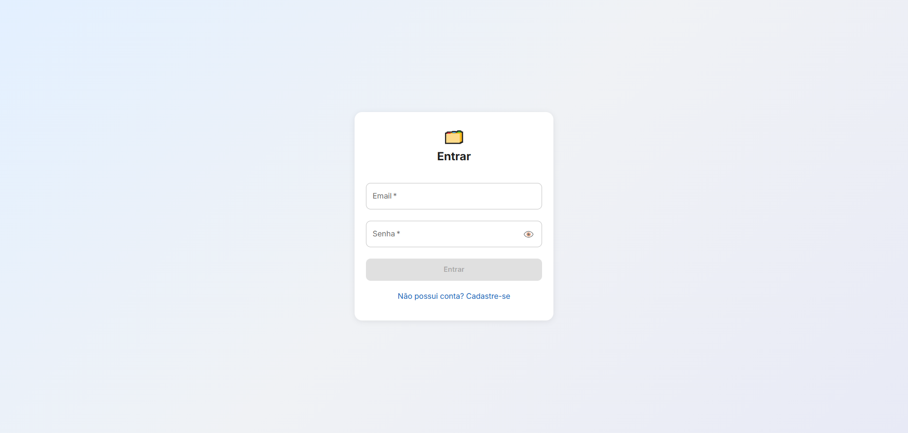
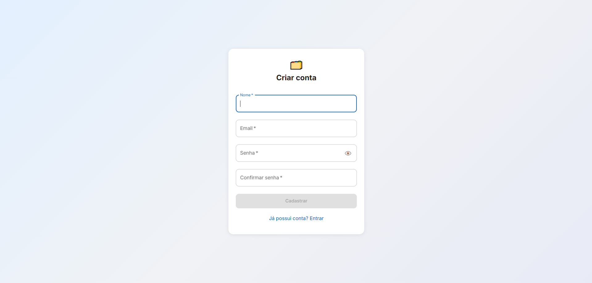
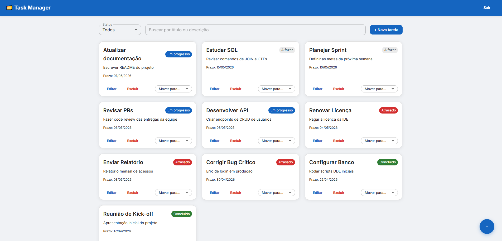
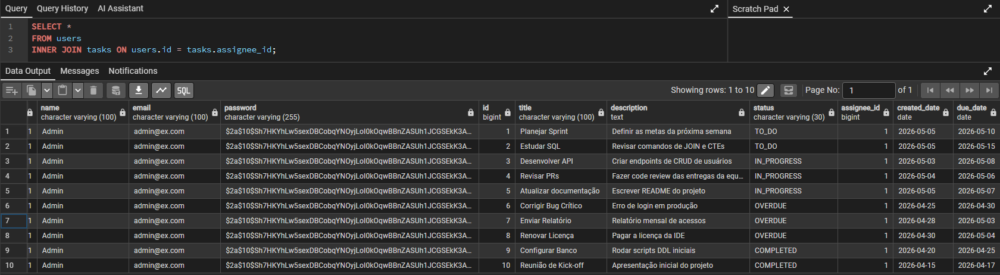
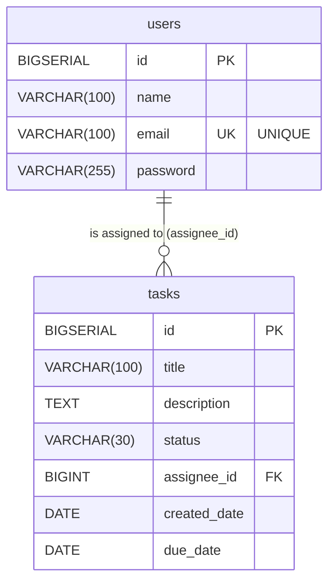

# 🗂️ Task Manager

Uma aplicação full-stack para gerenciamento de tarefas construída com **Spring Boot** e **React + Material UI**.
O sistema conta com um forte controle de segurança implementando autenticação e autorização via **JWT (JSON Web Tokens)**, garantindo acesso seguro e controle de propriedade das tarefas (cada usuário gerencia apenas suas próprias atividades). Além disso, a aplicação foi desenvolvida com foco no cumprimento rigoroso das regras de negócio e utiliza rotinas assíncronas (**Scheduled**) para verificar e atualizar automaticamente o status de tarefas vencidas diretamente no banco de dados.

---

## ✨ Destaques Técnicos do Projeto

* 🔒 **Autenticação e Segurança:** * Controle de sessões e rotas protegidas utilizando **Tokens JWT** (JSON Web Token).
  * Senhas dos usuários recebem criptografia antes de serem persistidas no banco de dados.

* 🛡️ **Tratamento Global de Erros (Exception Handling):** * Implementação de um manipulador de exceções global (`GlobalExceptionHandler` via Controller Advice).
  * Isso garante que erros internos de negócio (como tentar alterar uma tarefa que não lhe pertence ou passar um status inválido) não vazem a stack trace para o cliente, retornando respostas JSON padronizadas e limpas com o código HTTP adequado (ex: `400 Bad Request`, `403 Forbidden`, `404 Not Found`, `422 Unprocessable Entity`).

* ⏱️ **Processamento Assíncrono (Scheduled Tasks):** * Implementação de uma rotina automática e em background para identificar e marcar tarefas vencidas com o status `OVERDUE`.
  * *Nota de Arquitetura:* O job está configurado para rodar a cada 1 minuto com o objetivo de **facilitar a validação e testes práticos**. Contudo, como a regra de negócio se baseia em datas (`LocalDate`), para um ambiente produtivo a configuração ideal seria a execução de apenas 1x ao dia (ex: todo dia à meia-noite).

* 🔍 **Alta Performance com Full-Text Search (FTS):** * O tradicional e lento filtro via `LIKE %termo%` foi substituído pelo mecanismo nativo de FTS do PostgreSQL (`tsvector` e `websearch_to_tsquery`).
  * Isso confere maior precisão (lidando inteligentemente com operadores lógicos e acentuação) e resolve o problema de *Table Scan*, utilizando índices otimizados para garantir buscas em frações de milissegundo, mesmo com o banco crescendo.

* 🐳 **Ambiente 100% Dockerizado:** * Toda a infraestrutura do projeto (Backend em Spring, Frontend em React e o Banco de Dados PostgreSQL) está conteinerizada.
  * Através do `docker-compose`, é possível provisionar todo o ecossistema com um único comando, eliminando o clássico problema de "na minha máquina funciona" e dispensando a instalação prévia de SDKs e bancos locais.

---

## 📋 Sumário

- [Screenshots](#-screenshots)
- [Tecnologias](#-tecnologias)
- [Arquitetura](#-arquitetura)
- [Esquema do Banco de Dados (UML/ER)](#-esquema-do-banco-de-dados-umler)
- [Regras de Negócio](#-regras-de-negócio)
- [API Endpoints](#-api-endpoints)
- [Uso de IA](#-uso-de-ia)
- [Possíveis Futuras Melhorias](#-possíveis-futuras-melhorias)
- [Como Executar](#-como-executar)
- [URLs de Acesso](#-urls-de-acesso)
- [Credenciais de Teste](#-credenciais-de-teste)
- [Variáveis de Ambiente](#-environment-variables)

---

## 📸 Screenshots

Aqui estão algumas visões da aplicação em funcionamento:

### Tela de Login


### Tela de Registro


### Quadro de Tarefas (TaskBoard)


### Banco de dados


---

## 🛠️ Tecnologias

| Camada   | Tecnologia                                                    |
|----------|---------------------------------------------------------------|
| Backend  | Java 17, Spring Boot, Spring Security, Spring Data JPA        |
| Database | PostgreSQL 15+ com migrações via Flyway                       |
| Auth     | JWT (java-jwt da Auth0)                                       |
| Frontend | React 18, TypeScript, Material UI 5, Vite, Axios              |
| Docs     | Swagger / OpenAPI 3 (springdoc-openapi)                       |

---

## 🏗️ Arquitetura

```text
backend/
├── Application/
│   ├── Auth/        # Controller, Service e DTOs de Login/Registro
│   ├── Tasks/       # CRUD de Tarefas, máquina de estados, scheduler, specifications
│   └── Users/       # Entidade de Usuário, Repository, Mapper
├── Doc/             # Configuração do OpenAPI/Swagger
└── Infra/
    ├── Exception/   # Manipulador global de exceções, exceções personalizadas
    └── Security/    # Filtro JWT, serviço de token, configuração de segurança

frontend/
├── components/      # TaskCard, TaskFormDialog, StatusChip, ConfirmDialog
├── context/         # AuthContext (Gerenciamento de token JWT)
├── pages/           # LoginPage, RegisterPage, TaskboardPage
├── routes/          # AppRoutes, PrivateRoute
├── services/        # Cliente Axios, taskService, authService
├── types/           # Interfaces TypeScript (Task, Auth)
└── utils/           # Configuração de Tema do MUI
```

---

## 🗄️ Esquema do Banco de Dados (UML/ER)


---

## 📜 Regras de Negócio

- Toda tarefa deve ter **título** e **status**. 
- Ao criar uma tarefa, a **data de criação** deve ser preenchida automaticamente.
- Ao marcar uma tarefa como "Concluído", a tarefa deve refletir esse estado corretamente.
  - Cada status é indicado por uma **cor específica** no front-end.
- O filtro por status deve funcionar corretamente e a **busca deve considerar o título e a descrição**.
  - Implementação de **filtragem com parâmetros e paginação** utilizando de *FullTextSearch* 
- A tarefa deve refletir o status **Atrasado** (`OVERDUE`) quando a data atual for maior do que a data limite.
  - O sistema verifica isso na **inserção e edição** de uma task: Se `due_date < today` e `status ≠ COMPLETED`, então o status passa a ser `OVERDUE`.
  - Existe um `Scheduled async` que roda todo dia garantindo a atualização consistente no banco. Toda tarefa incompleta com `due_date < today` é marcada como `OVERDUE`.
  - *Problema da solução:* Definir quando o Scheduled deve rodar, pois em escala global é dificil dizer quando é o fim do dia, qual fuso tomar de parâmetro.
  - *Possível melhoria:* Otimizar esse processo utilizando Virtual Threads em versões mais atuais do Java (como Java 21)

---

## 📡 API Endpoints

### Auth

| Method | Endpoint          | Description         | Auth Required |
|--------|-------------------|---------------------|:-------------:|
| POST   | `/auth/login`     | Login, returns JWT  | ❌            |
| POST   | `/auth/register`  | Register new user   | ❌            |

### Tasks

| Method  | Endpoint               | Description                  | Auth Required |
|---------|------------------------|------------------------------|:-------------:|
| GET     | `/tasks`               | Lista tasks (paginada e com filtros)       | ✅            |
| GET     | `/tasks/{id}`          | Get task by ID               | ✅            |
| POST    | `/tasks`               | Cria uma nova Task           | ✅            |
| PUT     | `/tasks/{id}`          | Edita uma Task               | ✅            |
| PATCH   | `/tasks/{id}/status`   | Altera o status de uma task  | ✅            |
| DELETE  | `/tasks/{id}`          | Deleta uma task              | ✅            |

### Query Parameters (GET `/tasks`)

| Parameter | Type    | Description                              |
|-----------|---------|------------------------------------------|
| `status`  | String  | Filtro por status(TO_DO, IN_PROGRESS, OVERDUE, COMPLETED) |
| `search`  | String  | Pesquisa in title ou description           |
| `page`    | Integer | Número da página (0-indexed, default: 0)      |
| `size`    | Integer | Tamanho da página (default: 10)                  |
| `sort`    | String  | Ordenamento (default: created_date,desc) |

---

## 🤖 Uso de IA

Todas as atividades realizadas com o auxílio de IA foram revisadas para que condizessem com o que imaginei para o projeto:

- Criação inicial dos **DTOs e Mappers** para as entidades.
- Geração do **GlobalExceptionHandler** para tratamento padronizado de erros.
- Ajuste e incremento da **documentação com Swagger**.
- Ajuste das queries de filtros com o JPA, utilizando a interface **Specification**.
- Mapeamento basico das entidades e DTOs do Backend para o Frontend
- Melhoria das telas e componentes
- Configuração do **NGINX** como proxy reverso.
- Geração dos arquivos **Dockerfile** e do **docker-compose** final para compilação e execução no Docker.
- Melhorias no código e script do FULLTEXTSEARCH
- Criação do **README**

---

## 📰 Possíveis Futuras Melhorias

- **Swap and drop**: Implementar ordenamento arrastando e soltando tarefas.
- **SCHEDULED**: Utilizar **Virtual Threads** ou até mesmo criar um **serviço separado** dedicado apenas à rotina de verificação de atrasos.

---

## 🚀 Como Executar
O projeto está totalmente dockerizado.

**Pré-requisitos**
- Git
- Docker 

**Passo a Passo**
**1. Clone o repositório:**

```Bash
git clone https://github.com/G4brielV/Task-manager.git
cd Task-manager
```

**2. Suba os containers:**
```Bash
docker-compose up -d --build
``` 

## 🌐 URLs de Acesso

Com os containers em execução, você pode acessar a aplicação através das seguintes URLs:

- **Front-end**: [http://localhost:5173/](http://localhost:5173/)
- **Swagger (Documentação da API)**: [http://localhost:8080/swagger-ui/index.html#/](http://localhost:8080/swagger-ui/index.html#/)
- **PGADMIN**: [http://localhost:5050/](http://localhost:5050/) *(corrigido da porta 5173 para 5050 de acordo com o docker-compose)*
  - **Login PGADMIN**:
    - Email: `admin@admin.com`
    - Senha: `admin`

### Conectar no Banco de Dados via Cliente SQL

- **Host name:** `db`
- **Port:** `5432`
- **Maintenance database:** `postgres`
- **Username:** `admin`
- **Password:** `SENHA_SQL`

---

## 🔑 Credenciais de Teste

Para facilitar a avaliação, o banco de dados é iniciado com um usuário padrão que já possui Tasks cadastradas:

- **E-mail:** `admin@ex.com`
- **Senha:** `123456`

*(Ou sinta-se à vontade para criar uma nova conta na tela de cadastro).*

---

## 🔐 Variáveis de Ambiente

| Variable     | Description                    | Default                    |
|--------------|--------------------------------|----------------------------|
| `JWT_Secret` | Chave secreta do Token JWT     | `SenhaTokenSuperSecreta`   |

---
